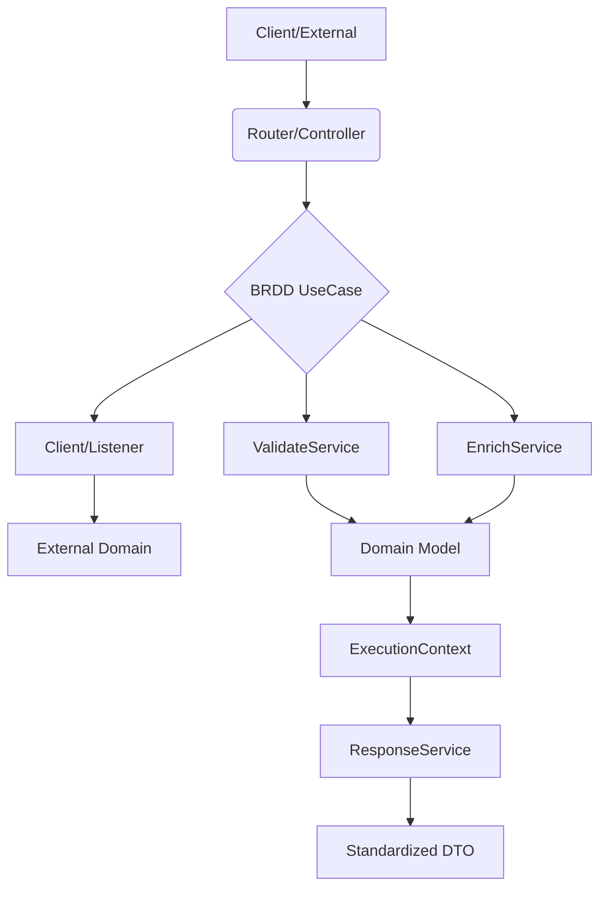
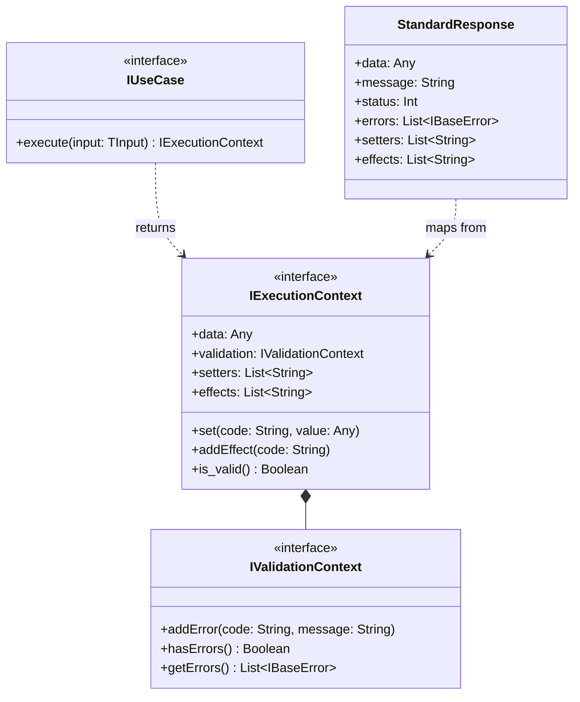

# Business Rule Driven Design (BRDD) 🚀

**Business Rule Driven Design (BRDD)** is an architectural pattern that prioritizes business rules as the primary drivers of software structure. It ensures that every logic branch is traceable, every side effect is documented, and every response is standardized.

BRDD sits as a **Business Logic Layer** that abstracts and formalizes the "Service Layer" found in traditional MVC or Clean Architecture patterns.

---

## 🏛 The Pillars of BRDD

### 1. Unique Rule Coding
Every validation or side effect must have a unique ID (e.g., `PROD_001`). This ID connects the code directly to the [Business Context](./BUSINESS_CONTEXT.md) (or similar documentation).

### 2. Execution Context Narrative
Use Cases return an `ExecutionContext` instead of raw data. This object contains:
- **Use Case Responsibility**: Use Cases MUST ALWAYS return an `ExecutionContext` instead of raw data. This object encapsulates the entire lifecycle of the business process.
- **ExecutionContext Narrative**:
  - **Data**: The primary result of the operation.
  - **Setters**: Automated field assignments (e.g., `SETTER_TIMESTAMP`).
  - **Effects**: Side effects triggered (e.g., `EFF_NOTIFY_ADMIN`).
  - **Validation**: A `ValidationContext` containing only rule compliance reports (errors).

> [!IMPORTANT]
> `ValidationContext` must strictly contain error reports. Setters and Effects are managed by the `ExecutionContext` through the UseCase orchestrator.

### 3. Service Specialization
BRDD divides logic into specialized roles to maintain clean boundaries:
- **UseCase**: The central orchestrator for a specific business process.
- **ValidateService**: Responsible only for business rule verification.
- **EnrichService**: Responsible for completing data before processing.
- **Client**: The bridge to **External Domains** (Third-party APIs, external services).
- **Listener**: The bridge for **Inbound External Events** (Webhooks, Message Queues).

### 4. Unified Response Pattern
All API interactions follow a strictly standardized JSON format, ensuring a consistent contract for frontend and mobile clients:
```json
{
  "data": { ... },
  "message": "Human-readable message",
  "status": 201,
  "errors": [],
  "setters": ["SETTER_UUID"],
  "effects": ["EFF_LOG_AUDIT"]
}
```

---

## 🔄 The BRDD Flow (MVC Integration)

In a web context, BRDD complements MVC by formalizing the "M" and the interaction between the Controller and the Domain.



## 🧩 Class / Interface Structure (Core Libraries)

The core libraries follow this fundamental interface contract to ensure cross-language compatibility:



## 🤖 AI-First Architectural Design

One of the most powerful and distinctive features of BRDD is its **AI-Native** nature. By design, BRDD creates a structure that is exceptionally easy for AI coding assistants to interpret, navigate, and extend.

### Why BRDD is the best pattern for AI-Driven Development:
- **Zero Ambiguity**: By isolating Rules, Setters, and Effects into specific services and metadata, the AI doesn't need to "guess" intent. The intent is explicitly declared in the code structure.
- **Contextual Instruction Carriers**: Documentation files (like `USE-CASES.md`) serve as "Master Prompts". An AI reading a Use Case definition can generate the entire boilerplate and business logic with near-perfect accuracy.
- **Traceable IDs**: The use of unique rule codes (e.g., `RULE_001`) allows the AI to link documentation, unit tests, and source code automatically.
- **Safety Gating**: Since `ValidateService` is decoupled from execution, an AI is less likely to introduce "logic leaks" or side effects during the validation phase.

### How to Apply BRDD in Your Project
There are two complementary ways to adopt the BRDD pattern:

#### 1. Importing the Native Libraries (Semantic Foundation)
You can import the official BRDD libraries (e.g., `brdd-python`, `@brdd-design/core`) into your project. These libraries provide the structural interfaces and base classes (`UseCase`, `ExecutionContext`, `ValidateService`). They are lightweight and act primarily as a **semantic foundation**, ensuring your code compiles and type-checks against the BRDD contract.

#### 2. Instructing the AI via `AGENTS.md` (The Prompting Approach)
Because BRDD is a structural philosophy, you don't *strictly* need the library to use it. You can achieve massive productivity gains simply by instructing your IDE (Cursor, GitHub Copilot, Gemini) to write code following the pattern.
We recommend creating an `AGENTS.md` (or adding to your system prompt) with the following instruction snippet:

```markdown
# Architectural Rules
This project strictly follows the Business Rule Driven Design (BRDD) pattern.
When creating, refactoring, or modifying business logic, you MUST adhere to these rules:
1. Orchestration: Use Cases MUST return a standardized ExecutionContext (containing data, setters, effects, and errors), never raw data.
2. Validation: Isolate all validation logic into a dedicated ValidateService. Use Cases must not contain validation IFs.
3. Traceability: Map all rules, validations, setters, and side effects with unique business codes (e.g., RULE_001, EFF_001).
4. Isolation: Never mix external I/O (DB calls, APIs) directly into the business logic. Use specialized Clients or Listeners.

For the full specification and structural blueprint, refer to the official documentation:
https://github.com/brdd-design/brdd/blob/main/BRDD.md
```
By providing this context, your AI assistant will naturally generate highly structured, predictable, and traceable code.

---

## 📄 Documentation-Driven Development (The .md Standard)

BRDD encourages maintaining a central `USE-CASES.md` file that acts as the source of truth for the system. This file should be structured to provide a clear roadmap for both humans and AI agents.

### The Use Case Blueprint:
Every Use Case should define:
1.  **Rules**: What must be true for this process to succeed?
2.  **Setters**: What internal fields are automatically updated?
3.  **Effects**: What external side effects are triggered?

> [!TIP]
> Treat your `USE-CASES.md` as part of the codebase. It is the **specification** that the AI uses to validate your implementation.

---

## 🏗 BRDD vs MVC / Clean Architecture
Is BRDD "above" MVC? 
BRDD is **orthogonal** to the interaction pattern. While MVC manages *how* the user interacts with the system, BRDD manages *how* the business rules are applied. 
- **In MVC**: It replaces the "Fat Service" or complex "Model" logic with a structured UseCase + Context flow.
- **In Clean Architecture**: It provides a concrete implementation for the "Interactors" layer that prioritizes rule traceability.

## 🎯 Key Benefits
- **Auditability**: Complete visibility into side effects and setters.
- **Consistency**: No more guessing what an endpoint returns.
- **AI-Native Implementation**: Drastically improves the quality of AI-generated code and facilitates automated testing.
- **Reduced Hallucinations**: Clear boundaries prevent the AI from inventing unintended logic or side effects.
---

## 🧩 The Modular Ecosystem

BRDD is more than just a pattern for synchronous logic. It is a modular ecosystem designed to handle different architectural complexities while maintaining the same core philosophy of traceability.

| Module | Status | Description |
| :--- | :--- | :--- |
| 💎 **Core** | ✅ Stable | The foundational specification for synchronous Use Cases and Unified Response. |
| ⚡ **Async** | 🧪 In Validation | Handles asynchronous messaging, event-driven architecture, and background processing. |
| ⚙️ **Async-BPMN** | 🧪 In Validation | Visual orchestration using the BPMN standard and the optimized **BBJN** notation. |
| 🔗 **Async-Chain** | 🧪 In Validation | Decentralized execution on Blockchain for processes requiring absolute trust and immutability. |
| ☁️ **Cloud** | 🧪 In Validation | A standardization guide for cloud resource organization and business-aligned naming. |

> [!IMPORTANT]
> **Validation Phase:** "In Validation" means the module is currently being battle-tested in complex production environments. This ensure that our "Manifesto" remains practical and resilient before official publication.
