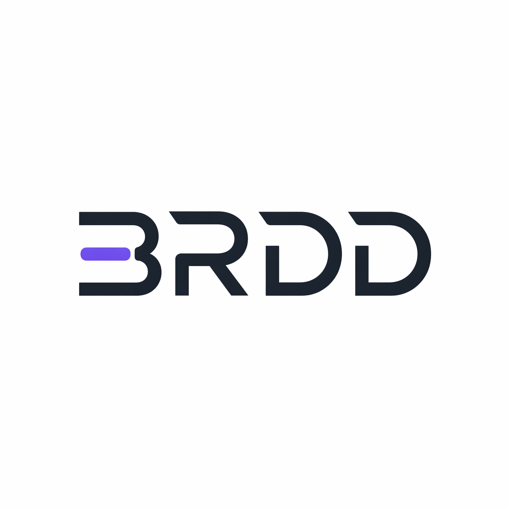
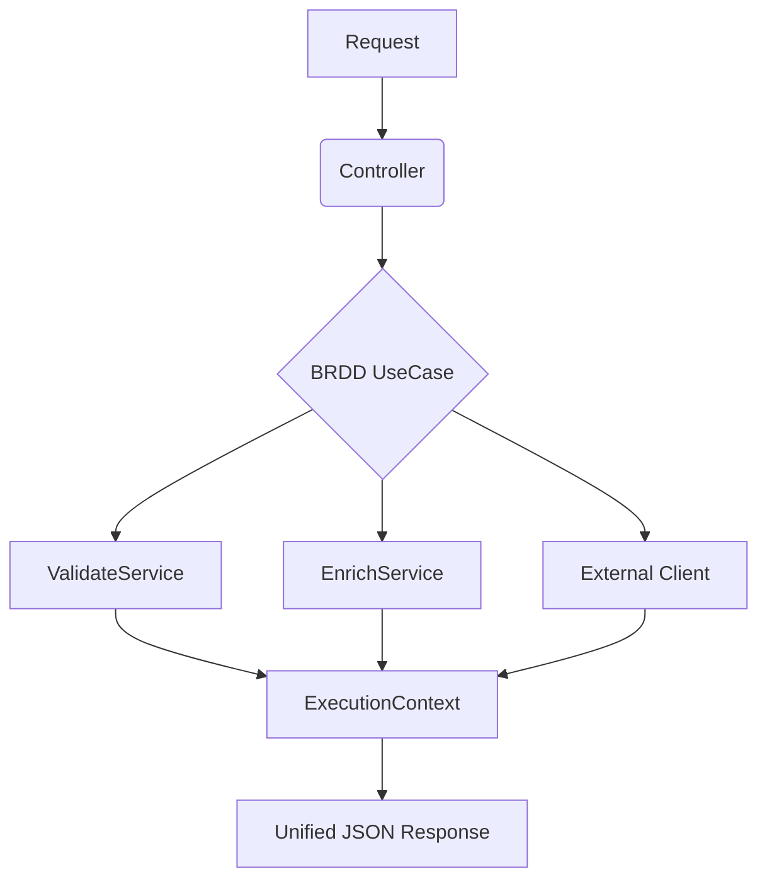

<div align="center">
  
  <br/>
  
</div>

# 🚀 Business Rule Driven Design (BRDD)

[](https://opensource.org/licenses/MIT)
[](https://www.npmjs.com/package/@brdd-design/core)
[](https://pypi.org/project/brdd-python/)
[](https://www.nuget.org/packages/Brdd.Design.Core/)
[](https://crates.io/crates/brdd-rust)

**Version:** 0.1.0 | **Status:** Beta | **Ecosystem:** Multi-Language

**Business Rule Driven Design (BRDD)** is an architectural pattern that prioritizes business rules as the primary drivers of software development. It ensures that every logic branch is traceable, every side effect is documented, and every response is standardized.

---

## 🎯 Why BRDD?

In traditional architectures, business logic is often diluted across Controllers, Services, and Entities. BRDD solves this by formalizing an **Orchestration Layer** where business rules are not just code, but a traceable narrative.

- **Total Traceability:** Every rule has a unique ID (e.g., `AUTH_001`).
- **Execution Narrative:** Responses that tell the story of *what happened* (Effects and Setters).
- **AI-Ready:** Highly predictable structure that facilitates automation by AI agents.

---

## 📖 Internal Documentation
- [**The Journey (Story)**](./articles/EN/BRDD-STORY.md): The story behind the birth of the design.
- [**The Manifesto**](./BRDD.md): The 4 Golden Rules formalized.
- [**Technical Specification (SPEC)**](./spec/SPEC.md): The technical contract for implementations.
- [**Practical Example**](./articles/EN/BRDD-PRACTICAL-EXAMPLE.md): Step-by-step implementation.

---

## 🏛 The Pillars

1.  **Unique Rule Coding:** Every validation is linked to a business context code.
2.  **Execution Context:** Use Cases return a complete context, not just raw data.
3.  **Service Specialization:** Clear division between `Validate`, `Enrich`, `Client`, and `Listener`.
4.  **Unified Response:** Rigid and predictable API contracts.

---

## 🧩 Ecosystem Modules

The BRDD project is modular. While the Core is stable, other modules are currently in a validation phase using real-world scenarios.

| Module | Status | Description |
| :--- | :--- | :--- |
| 💎 **Core** | ✅ Stable | The foundation. Unified response, execution context, and service specialization. |
| ⚡ **[Async](../../modules/async)** | 🧪 In Validation | Asynchronous flows, messaging, and event-driven patterns. |
| ⚙️ **[Async-BPMN](../../modules/async-bpmn)** | 🧪 In Validation | Visual orchestration using BPMN standard and BBJN notation. |
| 🔗 **[Async-Chain-BPMN](../../modules/async-chain-bpmn)** | 🧪 In Validation | Decentralized execution on Blockchain for high-trust processes. |
| ☁️ **[Cloud](../../modules/cloud)** | 🧪 In Validation | Resource traceability and neutral cloud naming conventions. |

> [!IMPORTANT]
> **Validation Phase:** "In Validation" means the module specification is established and is currently being battle-tested in production environments to ensure it handles complex real-world edge cases before final publication.

### 🔵 [BRDD Core (Hub)](https://github.com/brdd-design/brdd)
The foundation of the pattern. Contains the manifesto, technical specifications, and fundamental libraries.
- **Libraries:**
  - 🐍 [Python](https://pypi.org/project/brdd-python/) (`pip install brdd-python`)
  - 🔷 [.NET](https://www.nuget.org/packages/Brdd.Design.Core/) (`dotnet add package Brdd.Design.Core`)
  - 📜 [TypeScript](https://www.npmjs.com/package/@brdd-design/core) (`npm install @brdd-design/core`)
  - 🐹 [Go](https://github.com/brdd-design/brdd-go) (`go get github.com/brdd-design/brdd-go`)
  - 🦀 [Rust](https://crates.io/crates/brdd-rust) (`cargo add brdd-rust`)
  - ☕ [Java](https://central.sonatype.com/artifact/io.github.brdd-design/brdd-java) (`implementation 'io.github.brdd-design:brdd-java'`)
- **Docs:** [Manifesto](./BRDD.md) and [Specification](./spec/SPEC.md).

---

## 🤖 AI-Friendly Development

The standout feature of the BRDD ecosystem is native support for development by AI agents. Each library repository includes an `AI_GUIDELINES.md` file that serves as direct instructions for AI to build, test, and extend projects strictly following:
- **Low cognitive complexity.**
- **Total traceability via business codes.**
- **Unified response contracts.**

### How to Apply BRDD in Your Project
There are two complementary ways to adopt the BRDD pattern:

#### 1. Importing the Native Libraries (Semantic Foundation)
You can import the official BRDD libraries (e.g., `brdd-python`, `@brdd-design/core`) into your project. These libraries provide the structural interfaces and base classes (`UseCase`, `ExecutionContext`, `ValidateService`). They are lightweight and act primarily as a **semantic foundation**, ensuring your code compiles and type-checks against the BRDD contract.

#### 2. Instructing the AI via `AGENTS.md` (The Prompting Approach)
Because BRDD is a structural philosophy, you don't *strictly* need the library to use it. You can achieve massive productivity gains simply by instructing your IDE (Cursor, GitHub Copilot, Gemini) to write code following the pattern.
We recommend creating an `AGENTS.md` (or adding to your system prompt) with the following instruction snippet:

```markdown
# Architectural Rules
This project strictly follows the Business Rule Driven Design (BRDD) pattern.
When creating, refactoring, or modifying business logic, you MUST adhere to these rules:
1. Orchestration: Use Cases MUST return a standardized ExecutionContext (containing data, setters, effects, and errors), never raw data.
2. Validation: Isolate all validation logic into a dedicated ValidateService. Use Cases must not contain validation IFs.
3. Traceability: Map all rules, validations, setters, and side effects with unique business codes (e.g., RULE_001, EFF_001).
4. Isolation: Never mix external I/O (DB calls, APIs) directly into the business logic. Use specialized Clients or Listeners.

For the full specification and structural blueprint, refer to the official documentation:
https://github.com/brdd-design/brdd/blob/main/BRDD.md
```
By providing this context, your AI assistant will naturally generate highly structured, predictable, and traceable code.

---

## 🔄 Execution Flow



---

## 🌐 Site and Community

- 🌐 **[Official Website](https://brdd.design):** Knowledge hub and landing page.
- 📋 **[Publishing Checklist](./PUBLISHING_CHECKLIST.md):** Standards for new libraries.

## 🚀 How to Contribute

BRDD is an open pattern. If you wish to implement it for a new language or improve documentation:

1. Read the [Manifesto](./BRDD.md).
2. Explore libraries in the [GitHub Organization](https://github.com/brdd-design).
3. Open an issue or submit a PR.

---

<p align="center">
  Made with ❤️ by the [Business Rule Driven Design](https://github.com/brdd-design) community
</p>