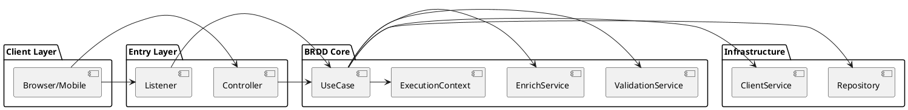
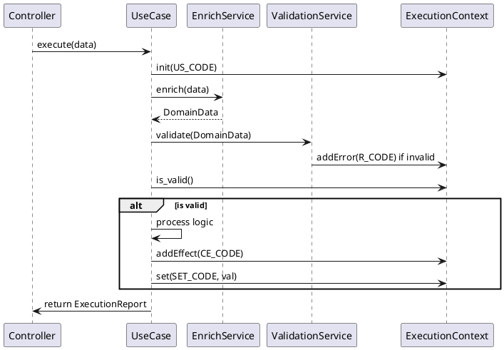
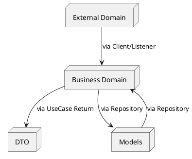
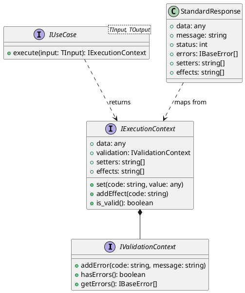

# 📐 BRDD Technical Diagrams (PlantUML)

This document contains the source code for the BRDD architecture diagrams. You can copy these blocks into any PlantUML viewer or use them as a reference for AI agents to understand the system structure.

---

## 1. High-Level Architecture
Describes the core layers and how they interact.

---

## 2. Core Execution Flow
Detailed sequence of a typical UseCase execution.

---

## 3. Data Transformation (4 Layers)
How data flows through the 4 semantic layers of BRDD.

---

## 4. Class / Interface Structure
Core interfaces based on the standard library implementations (TypeScript/C#/etc).

---

> [!TIP]
> You can render these diagrams online at [PlantText](https://www.planttext.com/) or using the VS Code PlantUML extension.
